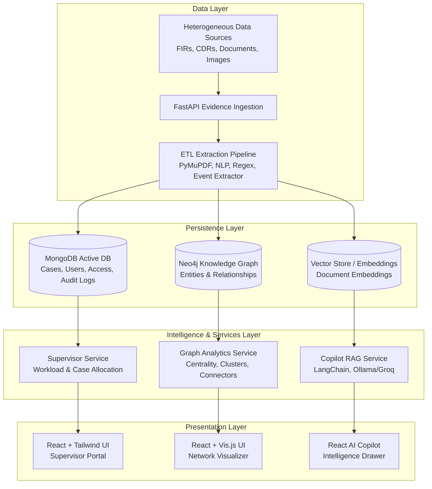

# NETRA

### AI-Driven Criminal Network Intelligence Platform

> **Discover hidden entities. Connect fragmented evidence. Reveal criminal networks.**

**Knowledge Graphs • Graph Analytics • NLP • RAG • LLM Copilot • Role-Based Access Control • ETL**

---

## 🔎 Overview

**NETRA** is an AI-driven criminal network intelligence platform engineered for law enforcement agencies and investigative bodies to transform fragmented investigation data into a connected, intelligence-rich Knowledge Graph.

Traditional police investigations require officers to manually cross-examine FIRs, case diaries, call detail records (CDRs), vehicle registries, financial transfers, and interrogation reports in isolation. NETRA consolidates these heterogeneous data sources, facilitating a fundamental operational shift:

> **Case-by-Case Investigation ──► Network-Level Intelligence**

The platform extracts entities (persons, phones, vehicles, bank accounts, locations, weapons, IPC sections) and relationships from structured and unstructured data, preparing them for deep graph analytics, automated link discovery, and AI-assisted investigation querying.

---

## 🌟 Key Capabilities & Portals

NETRA features a dual-portal architecture tailored to law enforcement organizational hierarchies:

### 🛡️ 1. Station Supervisor & Command Portal
Designed for Station House Officers (SHOs), Assistant Commissioners of Police (ACPs), and Department Heads:
- **Workload Management Dashboard**: Monitor officer active, pending, and completed case metrics with real-time visual workload indicators.
- **Case Assignment & Reassignment**: Allocate unassigned FIRs/cases to officers or transfer active dossiers between investigators with automated history tracking.
- **Case Transfer Audit Logs**: Immutable recording of all supervisor actions, officer reassignments, timestamps, and justification rationale.
- **Station Timeline History**: Complete historical timeline of case movements and personnel allocations across the station.

### 🔍 2. Investigator Analysis Workspace
Designed for lead investigators and field officers:
- **Interactive Knowledge Graph Visualizer**: Graph visualization powered by Vis-Network & Neo4j. Inspect suspect clusters, degree connections, and node attributes.
- **Graph Analytics & Metrics**: Calculate Betweenness Centrality, PageRank, Degree Centrality, and Community Detection to isolate hidden connectors and syndicate ringleaders.
- **Evidence Vault & Ingestion**: Upload PDF, image, FIR, CDR, and financial document evidence with automated NLP extraction of entities and events.
- **NETRA Intelligence Copilot**: AI assistant powered by GraphRAG and vector embeddings to answer natural language queries over dossier evidence.
- **National Criminal Cases Registry & Access Clearance**: Cross-jurisdiction case registry with single-click operational clearance request workflow (`RunningCasesModal`).

---

## 🧩 Data Sources & Extraction

| Data Category | Sources & Intelligence Extracted |
| :--- | :--- |
| **📄 Unstructured Evidence** | First Information Reports (FIRs), Case Diaries, Interrogation Memos, Search & Seizure Memos, Charge Sheets |
| **📊 Structured Records** | Call Detail Records (CDRs), Vehicle Registration DBs, Bank Account Transfers, License Registers, Suspect Registries |
| **📍 Spatial & Event Data** | Geo-locations, Crime Scenes, IP-based traces, IPC Sections, Event Timelines |
| **🔗 Relationship Data** | Financial transfers, co-location, ownership, communication links, syndicate hierarchy |

---

## 🏗️ High-Level System Architecture



---

## 🗄️ Data Architecture

NETRA separates core system collections into active operational workspaces and master reference repositories in MongoDB:

### MongoDB Collections (`netra_active` / `netra_master`):

```text
├── users                     # Officer accounts, roles (supervisor / investigator), rank, state, department
├── cases                     # Investigation dossiers, FIR numbers, threat levels, assigned officer
├── case_access               # Access control list (lead investigator, authorized police IDs per case)
├── case_access_requests      # Operational clearance requests between officers
├── case_assignment_history   # Reassignment & transfer timeline logs
├── supervisor_audit_logs     # Immutable supervisor action records
├── documents                 # Uploaded evidence metadata and extracted payload
├── entities                  # Master extracted entities (Person, Phone, Vehicle, Account, Location, Organization)
└── relationships             # Graph edges (OWNS, CALLED, TRANSFERRED_FUNDS, ASSOCIATED_WITH, OCCURRED_AT)
```

---

## 🕸️ Knowledge Graph Model

In **Neo4j**, entities and relationships form a connected web across cases:

```text
 (Person:Suspect) ──[OWNS]──► (Vehicle) ──[USED_IN]──► (Event:CrimeScene)
        │                                                     │
    [CALLS]                                              [OCCURRED_AT]
        ▼                                                     ▼
  (Phone:CDR) ──[TRANSFERRED_FUNDS]──► (Account) ──► (Location)
```

---

## ⚙️ Technology Stack

| Layer | Technology |
| :--- | :--- |
| **Backend Framework** | Python 3.11+, FastAPI, Pydantic |
| **Database System** | MongoDB (PyMongo) |
| **Knowledge Graph** | Neo4j (Python Neo4j Driver) |
| **AI / RAG / Copilot** | LangChain, Ollama, Groq, PyMuPDF, Sentence-Transformers |
| **Package & Env Manager**| `uv` |
| **Frontend UI** | React 18, Vite, TailwindCSS, Lucide Icons, Vis-Network |
| **Security & Auth** | JWT (`python-jose`), Passlib, Bcrypt |

---

## 📁 Project Structure

```text
NETRA/
├── apps/
│   ├── backend/
│   │   ├── app/
│   │   │   ├── api/
│   │   │   │   └── routes/         # FastAPI API Routers (auth, cases, supervisor, graph, copilot, etc.)
│   │   │   ├── core/               # Configuration & Security
│   │   │   ├── db/                 # MongoDB & Neo4j Database Connectors
│   │   │   ├── models/             # PyDantic Schemas
│   │   │   ├── services/           # Business logic (supervisor, case access, graph, copilot)
│   │   │   └── main.py             # FastAPI App Entrypoint
│   │   └── scripts/
│   │       ├── seed_presentation_officers.py  # Presentation Seeding Script
│   │       └── load_master_data.py
│   └── frontend/
│       ├── src/
│       │   ├── components/         # SupervisorDashboard, NetworkGraph, DashboardOverview, Header, etc.
│       │   ├── pages/              # Login, Register
│       │   ├── services/           # Frontend API Clients (apiClient, caseService, supervisorService)
│       │   └── App.jsx             # Main Application Container
│       ├── index.html
│       ├── vite.config.js
│       └── package.json
├── etl/                            # Entity & Relationship Extraction Pipelines
├── data/                           # Structured & Unstructured Sample Datasets
├── pyproject.toml                  # Python Dependencies & uv configuration
└── README.md
```

---

## 🚀 Getting Started

### 1. Prerequisites
- **Python 3.11+** installed
- **Node.js 18+** & `npm` installed
- **MongoDB** running locally or a valid MongoDB Atlas URI
- `uv` installed (`pip install uv` or `curl -LsSf https://astral.sh/uv/install.sh | sh`)

---

### 2. Environment Configuration

Create a `.env` file in the project root:

```env
MONGO_URI=mongodb://localhost:27017
MONGO_DB_NAME=netra_active
JWT_SECRET=your_super_secret_jwt_key_here
ALGORITHM=HS256
ACCESS_TOKEN_EXPIRE_MINUTES=1440
NEO4J_URI=bolt://localhost:7687
NEO4J_USER=neo4j
NEO4J_PASSWORD=your_neo4j_password
```

---

### 3. Backend Setup & Running

Install dependencies using `uv`:

```bash
uv sync
```

Run the backend development server:

```bash
PYTHONPATH=.:apps/backend uv run uvicorn app.main:app --reload --host 127.0.0.1 --port 8000
```

*The API documentation is available at `http://127.0.0.1:8000/docs`.*

---

### 4. Seed Presentation Officers & Sample Cases

To quickly populate 10 realistic police officer accounts (from ACP to Constable) and sample cases for demonstration:

```bash
PYTHONPATH=apps/backend:. uv run python apps/backend/scripts/seed_presentation_officers.py
```

*Seeded officers default password: `Police@12345`*  
*Supervisor ID: `P411` (ACP Nishant Khatkar) or `SHO-101` (SHO Vikramjit Singh)*

---

### 5. Frontend Setup & Running

In a separate terminal, navigate to the frontend directory and start the Vite dev server:

```bash
cd apps/frontend
npm install
npm run dev
```

*Access the NETRA frontend at `http://localhost:5173`.*

---

## 📡 Key API Routes

| HTTP Method | Endpoint | Description |
| :--- | :--- | :--- |
| `POST` | `/auth/login` | Officer / Supervisor Authentication |
| `GET` | `/auth/me` | Current authenticated officer profile & case access list |
| `GET` | `/cases` | Fetch authorized dossiers for active user |
| `POST` | `/cases` | Open a new dossier |
| `GET` | `/supervisor/cases` | Supervisor view of all station cases & allocation statuses |
| `POST` | `/supervisor/cases/{case_id}/assign` | Assign a case to an officer |
| `POST` | `/supervisor/cases/{case_id}/transfer` | Reassign / transfer a case between officers |
| `GET` | `/supervisor/officers` | Fetch officer workload metrics & active case counts |
| `GET` | `/supervisor/history` | Case assignment & transfer historical timeline |
| `GET` | `/supervisor/audit-logs` | Station supervisor audit log records |
| `GET` | `/api/cases/{case_id}/graph` | Fetch graph nodes & relationships for Vis.js visualization |
| `POST` | `/copilot/chat` | AI Copilot RAG chat endpoint over dossier evidence |

---

## 🔐 Security & Data Governance

- **Role-Based Scoping**: Explicit separation between Station Supervisors (station-wide allocation control) and Investigators (dossier-level analysis).
- **JWT Authentication**: Bearer token auth header validation on protected endpoints.
- **Audit Compliance**: All case transfers, assignments, and access grants are immutably logged with supervisor credentials and timestamp provenance.
- **Temporary Upload Lifecycle**: Processed files are cleaned up from temporary storage post-ingestion; extracted payloads persist safely in structured DB collections.

---

## ⚠️ Disclaimer

NETRA is an intelligence analysis and operational support system designed to assist law enforcement agencies. Its outputs (graphs, analytics, and AI copilot responses) provide investigative leads and correlation support. They should be evaluated by qualified investigators and are not automatic legal determinations of criminal liability.
