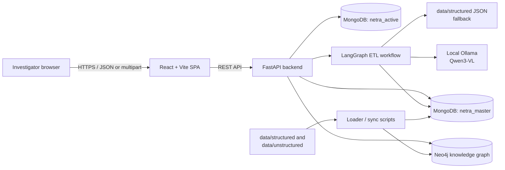
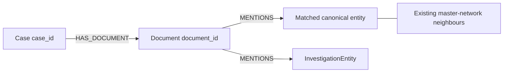
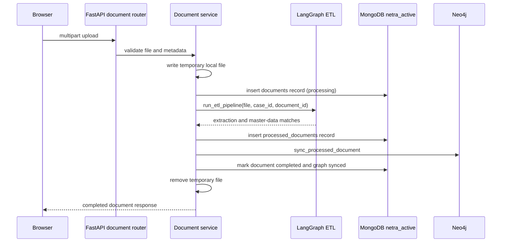
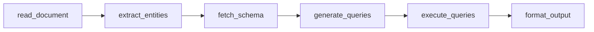

# NETRA Architecture

This document describes the architecture implemented in the repository as of
September 2026. It distinguishes the live application path from supporting and
experimental modules so that it does not imply unimplemented functionality.

## System overview

NETRA is an investigation workspace that connects case dossiers, uploaded
evidence, master intelligence, and a Neo4j knowledge graph. The implemented
runtime has three layers:

1. A React/Vite single-page application used by investigators.
2. A FastAPI backend for API requests, authentication, ingestion, access
   control, graph reads, and analytics.
3. MongoDB and Neo4j stores, plus a local Ollama model for extraction and
   copilot generation.

The browser talks only to FastAPI. MongoDB, Neo4j, and Ollama are backend-side
dependencies and should not be exposed directly to browser clients.

## Repository layout and responsibility

| Location | Role in the current architecture |
| --- | --- |
| `apps/frontend` | React/Vite investigation UI and REST client. |
| `apps/backend/app` | FastAPI application, API routers, database clients, services, schemas, and models. |
| `apps/backend/scripts` | One-off data load, graph-sync, and end-to-end verification scripts. |
| `etl/pipelines` | LangGraph document ETL and extraction/query-generation helpers. |
| `ai/graph` | Graph copilot implementation and Neo4j retrieval helpers. |
| `ai/agents`, `ai/chains`, `ai/rag` | Supporting/experimental AI code; not registered as FastAPI routes. |
| `data/structured` | Local JSON master-data fallback and loader input. |
| `data/unstructured` | Seed investigation text, organised by `CASE-xxxx`. |
| `infrastructure` | Intended infrastructure location. Docker Compose, Dockerfile, and Neo4j Cypher files are currently empty. |
| `packages/shared` | Reserved shared package; its TypeScript source files are currently empty. |

## Runtime components

### Frontend: React investigation workspace

The frontend is a Vite application rooted at `apps/frontend/src/main.jsx`. It
renders `App.jsx`, which gates the workspace behind login/register pages and
maintains selected case, active tab, evidence list, selected entity, upload
modal, and copilot drawer state.

| Component | Responsibility | Data source / integration |
| --- | --- | --- |
| `Sidebar`, `Header` | Case selection and workspace navigation. | Case state held in `App`. |
| `DashboardOverview` | High-level dossier overview. | Selected case payload. |
| `EvidenceVault` | Evidence listing and upload entry point. | Initial JSON plus `/documents/{case_id}`. |
| `DocumentUploadModal` | Client validation and multipart evidence upload. | `POST /documents/upload`. |
| `NetworkGraph` | vis-network visualisation, filtering, export, and analysis controls. | Graph API authorisation and selected case data. |
| `EntityDrawer` | Detail view for a selected visualised entity. | Entity selected in the graph. |
| `AIChatbotDrawer` | Question-and-answer UI. | `POST /copilot/chat`. |

`apiClient.js` uses `VITE_API_URL`, defaulting to
`http://localhost:8000`. It adds `Authorization: Bearer <token>` when
`netra_token` exists in local storage. The user profile is stored as
`netra_user`.

The UI has deliberate local-demo fallbacks:

- `caseService` uses `src/data/casesData.json` when `/cases` is unavailable.
- `documentService` can return a simulated successful ingestion result when
  the backend cannot be reached.
- Evidence begins with `src/data/evidenceData.json` and is merged with backend
  metadata when available.

Important current boundary: `NetworkGraph` calls the backend graph endpoint to
establish graph availability and case access, but renders
`parseCaseToGraph(caseData)` from the selected case object. It does not yet map
the returned Neo4j `nodes` and `edges` into the visualisation. Neo4j currently
authorises the visual view but is not its rendered data source.

### Backend: FastAPI

`apps/backend/app/main.py` creates the FastAPI application, installs permissive
CORS (`allow_origins=["*"]`, credentials/methods/headers enabled), and registers
six routers:

| Router | Prefix | Current responsibility |
| --- | --- | --- |
| Authentication | `/auth` | Registration, login, session-backed JWT validation, logout, current-user lookup, and account deletion. |
| Cases | `/cases` | List/read case dossiers from active MongoDB, with frontend JSON fallback. |
| Documents | `/documents` | Synchronous file validation, ETL, Mongo persistence, and Neo4j sync. |
| Graph | `/api` | Case-scoped graph reads and analytics. |
| Case access | `/case-access` | Lead investigator, access request, transfer, and revocation workflow. |
| Copilot | `/copilot` | Graph question answering. |

`entities.py` and `network.py` define no routes and are not registered. The
complete HTTP contract is maintained in [api.md](api.md).

### Authentication and case access

Authentication is backed by `netra_active` MongoDB collections:

- Users have bcrypt `password_hash`, police identity/rank data, and `is_active`.
- Login issues an HS256 JWT with one-hour expiry and a random session ID (`jti`).
- New sessions store a SHA-256 token hash, expiry, and revocation state; legacy
  plaintext session records remain recognised.
- `get_current_user` checks the active session, JWT signature/expiry, `jti`,
  user existence, and active state.

`case_access` is the membership source of truth. A document maps a `case_id`
to `lead_investigator_police_id` and a `police_ids` array. User
`case_access_ids` is derived from this collection rather than copied into a
user document. A lead can transfer leadership, approve/reject requests, and
revoke another investigator. Unique and lookup indexes support membership and
pending requests.

Graph, analytics, and case-access routes require authenticated membership.
Case listings, document endpoints, and copilot are currently public; this is
an implementation fact, not a recommended production security posture.

## Data architecture

### MongoDB databases

The MongoDB client uses `MONGO_URI` and `certifi` TLS validation. It opens two
logical databases on the same Mongo deployment.

| Database | Collection / record family | Purpose |
| --- | --- | --- |
| `netra_master` | `persons`, `phones`, `vehicles`, `accounts`, `licenses` | Canonical identity and reference data. |
| `netra_master` | `call_records`, `social_media`, `weapons`, `transactions`, `edges` | Canonical events and relationships. |
| `netra_master` | `entities` | Entities extracted from seed unstructured documents. |
| `netra_active` | `cases` | Active case dossiers, used by `/cases` when populated. |
| `netra_active` | `documents` | Upload metadata, status, and processing errors. |
| `netra_active` | `processed_documents` | Successful ETL payload plus Neo4j graph-sync status. |
| `netra_active` | `users`, `sessions` | Investigator accounts and server-side session records. |
| `netra_active` | `case_access`, `case_access_requests` | Case membership, leadership, and pending decisions. |

The application does not create one collection per case. `case_id` and
`document_id` link active data. MongoDB fields are flexible; Pydantic validates
only selected HTTP request and response models.

### Local seed-data fallback

The checked-in structured data supports development and degraded ETL operation:

- The master-data loader imports ten `*_global.json` files into `netra_master`.
- ETL first queries MongoDB master collections and supplements unavailable or
  unmatched searches with corresponding local JSON data.
- The case API falls back to `apps/frontend/src/data/casesData.json` when
  active MongoDB has no case documents or is unavailable.

### Neo4j knowledge graph

Neo4j holds canonical network data and case/document context. The graph service
uses `NEO4J_URI`, `NEO4J_USERNAME`, and `NEO4J_PASSWORD`, creating its driver at
module import time.

| Data family | Neo4j label | Representative relationships |
| --- | --- | --- |
| Identity | `Person`, `Phone`, `Vehicle`, `Account`, `License` | `Person-[:USES]->Phone`, `Person-[:OWNS]->Vehicle/Account`, `Person-[:HAS_LICENSE]->License` |
| Communications | `SocialMedia`, call relationships | `Phone-[:CALLED]->Phone`, `Person-[:INTERACTED_ON]->SocialMedia-[:TARGETS]->Person` |
| Evidence / finance | `Weapon`, `Transaction` | `Person-[:SEIZED_WITH]->Weapon`, `Account-[:SENT]->Transaction-[:RECEIVED_BY]->Account` |
| Generic seed edges | Existing node labels | Typed relationship from `edges.relation`, with `edge_id`, `weight`, and optional `case_id`. |

Current-case ETL uses a case subgraph:

When database intelligence resolves an extracted entity to a master record, the
document links to that existing canonical node instead of creating a duplicate.
Unmatched extractions are retained as `InvestigationEntity` nodes with a stable
SHA-1 identifier based on `(case_id, document_id, entity_type, value)`.

`GET /api/cases/{case_id}/graph` returns entities mentioned by a case's
documents plus related nodes up to two graph hops away, including Neo4j element
IDs, labels, properties, and relationship information.

### Graph analytics

Analytics uses a transient, case-scoped Neo4j GDS projection:

1. Select entities mentioned by the case and their one/two-hop neighbours.
2. Project candidate nodes and relationships under a unique temporary name.
3. Run Louvain community detection or PageRank centrality, then drop the
   projection in a `finally` block.
4. Run anomaly detection as direct Cypher for entities with degree over five,
   returning at most ten nodes.

Neo4j Graph Data Science is therefore required for `communities` and
`centrality`. If it or Neo4j is unavailable, those routes return `503` after
access is checked. The graph-read endpoint instead returns an empty `200`
payload with an error status after an authorised Neo4j failure.

## Document ingestion and ETL

### Upload path

Document ingestion is synchronous in the API request lifecycle. There is no
queue, worker, retry processor, or object-storage integration in the current
application.

The service accepts PDF, JPEG, PNG, and WEBP MIME types, rejects empty files,
and limits each file to 10 MiB. It writes raw uploads only to a temporary file
and deletes it in a `finally` block. Metadata is inserted before ETL; a later
failure marks that record `failed` and stores an error string.

### LangGraph ETL workflow

`etl/pipelines/build_graph.py` compiles this linear state machine:

| Stage | Current implementation |
| --- | --- |
| Read document | Reads TXT/Markdown/CSV/log/JSON directly. PDFs use `pypdf`, then PyMuPDF if available. |
| Extract entities | Calls local Ollama through LangChain and normalises supported entity types. On failure, uses regex/name heuristics. |
| Fetch schema | Supplies an in-code description of master-data collections and field paths. |
| Generate queries | Uses the LLM to make Mongo-shaped queries; falls back to type-specific regex query generation. |
| Execute queries | Queries `netra_master`, then supplements unmatched/unavailable results from local structured JSON. |
| Format output | Returns status, entities, generated queries, database intelligence, and summary counts. |

Supported extraction types are `Person`, `Phone`, `Vehicle`, `Account`,
`License`, `Location`, `Organization`, `SocialMedia`, `Weapon`, and
`Transaction`. Location and organisation remain extraction intelligence but
have no matching master collection lookup.

The upload route accepts image MIME types, but the text extractor has no OCR or
image-analysis branch. Image uploads should be considered unsupported for
meaningful extraction until OCR is added.

### Historical data loading

The loader scripts are separate from the request path:

- `load_master_data.py` **drops every existing collection** in `netra_master`
  and imports the ten structured JSON collections. It is destructive and meant
  for controlled development/seed reloads.
- `load_existing_unstructured.py` processes each `.txt` file in
  `data/unstructured/CASE-*` and upserts extracted entities into
  `netra_master.entities`. A compound unique index prevents duplicate entities
  for the same case, source file, type, and value.
- `load_case_0001_to_neo4j.py` synchronises master graph data and processes
  seed `CASE-0001` files into its case graph.
- `run_e2e_test.py` orchestrates the destructive structured load, unstructured
  ingestion/dedup check, optional Neo4j sync, and collection-count report.

## AI and retrieval components

### Graph copilot: exposed, but not case-scoped

`POST /copilot/chat` creates a singleton `GraphChatbot`. It parses a question,
recognises supported intents around people, phones, vehicles, accounts, and
licences, retrieves facts through `GraphRetriever`, and asks the local Ollama
model to formulate an answer. If initialisation or answering fails, the route
returns a successful fallback payload with error information.

The copilot does not use the supplied `case_id` in its graph retrieval and does
not enforce case membership. Its current retrieval is global knowledge-graph
retrieval, not authorised case-scoped RAG.

### Present but not integrated into FastAPI

`RagService`, `ai/rag`, `ai/agents`, and `ai/chains` are repository modules,
but no router invokes them. `RagService` itself samples generic Neo4j context
and up to five processed-document payloads before calling the local LLM; it
does not currently provide vector-store retrieval in the served application.
Treat these modules as foundations for future intelligence features, not
current API capabilities.

## Configuration and external dependencies

| Setting / dependency | Used by | Notes |
| --- | --- | --- |
| `MONGO_URI` | Mongo client, user/session/case stores, ETL master lookup | Required at import time by `app.db.mongodb`. |
| `NEO4J_URI`, `NEO4J_USERNAME`, `NEO4J_PASSWORD` | Graph service, analytics, RAG service | Required at import time by the graph service. |
| `JWT_SECRET` | Auth router | Defaults to `change-this-secret`; production must provide a strong secret. |
| `VITE_API_URL` | Frontend REST client | Defaults to `http://localhost:8000`. |
| `OLLAMA_MODEL`, `OLLAMA_BASE_URL` | ETL and copilot | Defaults to `qwen3-vl:4b` at `http://localhost:11434`. |
| Neo4j GDS | Graph analytics | Needed for temporary projection, Louvain, and PageRank. |

Environment loaders search for `.env` from relevant module paths. Do not commit
secrets. Dependencies are declared at the repository root, `apps/backend`,
`etl`, and `ai`; these should be reconciled before a production build is
formalised.

## Security, reliability, and current limits

| Area | Current behaviour | Production consideration |
| --- | --- | --- |
| Browser tokens | Token and user profile are kept in `localStorage`. | Protect against XSS; evaluate secure HttpOnly cookies or a stricter token strategy. |
| CORS | Any origin is allowed while credentials are enabled. | Restrict origins to deployed frontend domains. |
| Route protection | Graph/analytics/case-access are protected; cases, documents, and copilot are public. | Apply case access consistently to evidence and copilot. |
| File persistence | Raw upload is temporary; metadata and processed output are stored. | Use encrypted, access-controlled evidence storage and retention/audit policies. |
| Ingestion execution | ETL and graph sync execute inside the upload request. | Introduce durable jobs, retries, status polling, and dead-letter handling. |
| Image support | Images pass MIME validation, but no OCR pipeline exists. | Add OCR/vision extraction and test it separately. |
| Data integrity | Mongo collections are flexible; graph updates are not transactional with Mongo writes. | Add validation, repair/reconciliation jobs, and observability. |
| Deployment | Docker/Compose/Cypher infrastructure files are empty. | Define repeatable containers, networks, secrets, backups, and migrations. |
| Logging | Services mix `print`, standard logging, and returned errors. | Standardise structured logs, tracing, metrics, and redaction. |

## End-to-end behaviour

### Investigator signs in and opens a case

1. The frontend posts credentials to `/auth/login` and stores the token/profile.
2. It requests `/cases`; FastAPI reads `netra_active.cases` or returns frontend
   JSON fallback data.
3. Selecting a case requests document metadata and attempts the protected graph
   endpoint.
4. The graph endpoint validates the session and `case_access` membership before
   Neo4j access. The frontend currently uses this as a graph-access gate and
   renders the selected dossier's local graph representation.

### Investigator uploads evidence

1. The browser validates the file and submits multipart data.
2. FastAPI repeats validation, records metadata as processing, and runs ETL
   synchronously.
3. ETL extracts entities, finds master intelligence, and returns a structured
   result.
4. The backend stores the result, synchronises document/entity mentions to
   Neo4j, marks it complete, removes the temporary file, and returns a response.
5. The browser adds the returned document to its in-memory Evidence Vault.

### Lead manages graph access

1. An authenticated investigator claims an unconfigured case as lead, or the
   current lead transfers leadership.
2. A non-member creates one pending access request per case.
3. The lead lists the queue and approves or rejects the request.
4. Approval adds the requester's police ID to `police_ids`; graph and analytics
   requests are then authorised for that user.

## Architecture evolution priorities

1. Make graph rendering consume the authorised Neo4j graph response instead of
   only using it as an access check.
2. Require case access for documents and copilot, and make copilot retrieval
   explicitly case-scoped.
3. Replace in-request ETL with asynchronous jobs and durable evidence storage.
4. Add OCR for supported image uploads and formal ETL-output schemas.
5. Complete Docker/Compose, database/index provisioning, Neo4j constraints,
   and production observability.
6. Consolidate dependency management and add integration tests for auth, case
   access, upload, graph sync, and analytics together.
